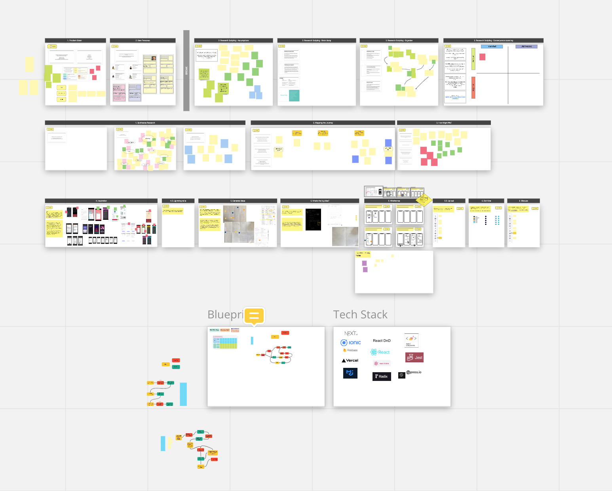
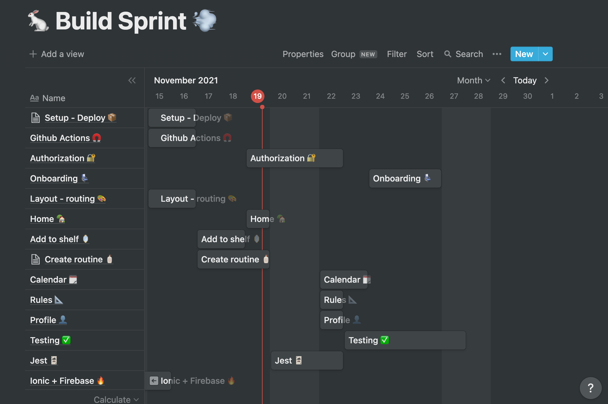

# Skin Goals 🧴

## Introduction ✨

- We are building a skin care application. Our goal is to provide an environment where the user can plan and build their skin care routines based on their personal preferences.
- At the same time, we aim to provide accurate information on the usage of some ingredients that do not bode well together and prevent the user from malpractices.

## Project scope

What are you not building?
This app does not suggest skincare routines to users, the app does not give advices

How did you decide what features were important?

## Project plan 📆

- We spent one week for user research and design. The next `Miro` board sums up our findings 🕸️
  
- To be able to implement an MVP, we agreed to focus on the most important functionalities first 🧱
  - Login/Sign Up
  - Home page
  - Routines page
  - My Products page
- The first week was mostly dedicated to frontend. We aimed to present a first draft of our application, with working routing and basic functionality using fake local data.
- The second week, we will focus more on trying to add the back end to our app and make it work with real data that will interact with a database.
- We use `Notion` to make a generic plan of our 2 building weeks, before starting adding issues to our `Github` repo 👓
  

## Requirement analysis

- We are using the `Ionic` framework, which provides semantic HTML elements. This should make our application easily readable by screen-readers.

## Project learnings
### Routing in `Ionic`
- The `Ionic` framework relies on the native `React` router. 
- The `<IonReactRouter>` wraps the `<Route>` elements.

### Coming up...
- Drag & Drop
- CSS 
- State management 

## Research and findings

## Project outcomes

## Recommendations and conclusions

## Software Development Lifecycle stages

- ### Planning
- ### Analysis
- ### Design
- ### Implementation/Build
- ### Test
- ### Deploy
- ### Maintain
